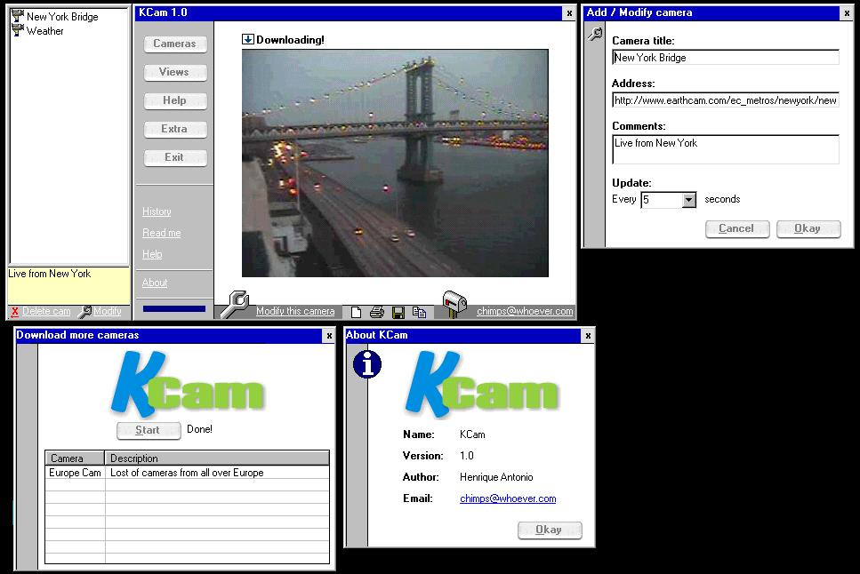



## KCam 1\.0

### Description

This program allows you to view web cams. They are refreshed at a certain interval. The cameras are stored in kcf file (KCam files). Here are some of the features:

- Different views (small, normal, large)

- Full Screen view

- Add/delete/modify camera information

- View comments about cameras as you choose them

- Download new KCam database with new cameras

from the web.

- Print camera image

- Copy to clipboard

- Save them

- ProgressBar that indicates update interval

- and more...

Please vote for it if you like it.
 
### More Info
 

             |
---                |---
**Submitted On**   |2001-11-04 19:02:50
**By**             |[Chimps](https://github.com/Planet-Source-Code/PSCIndex/blob/master/ByAuthor/chimps.md)
**Level**          |Intermediate
**User Rating**    |4.6 (32 globes from 7 users)
**Compatibility**  |VB 6\.0
**Category**       |[Complete Applications](https://github.com/Planet-Source-Code/PSCIndex/blob/master/ByCategory/complete-applications__1-27.md)
**World**          |[Visual Basic](https://github.com/Planet-Source-Code/PSCIndex/blob/master/ByWorld/visual-basic.md)
**Archive File**   |[KCam\_1\_0333011142001\.zip](https://github.com/Planet-Source-Code/chimps-kcam-1-0__1-28649/archive/master.zip)

### API Declarations

A few

